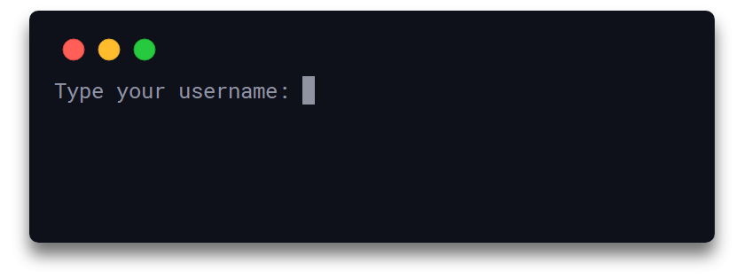
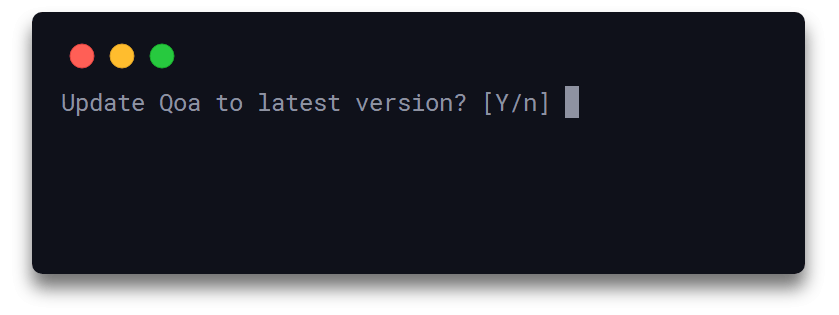
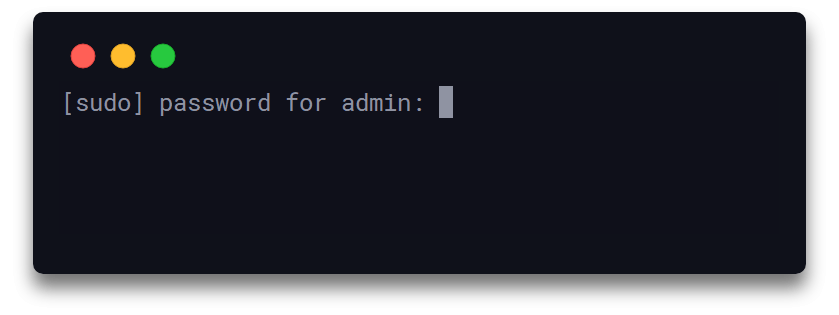
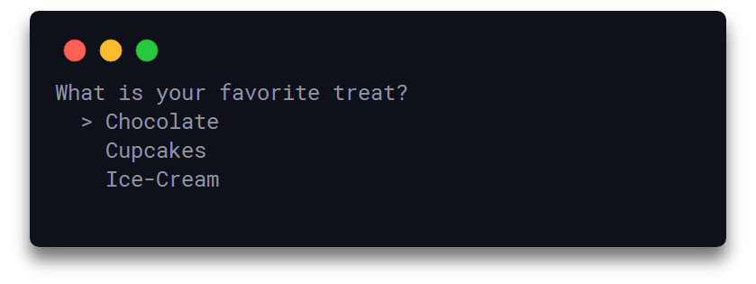
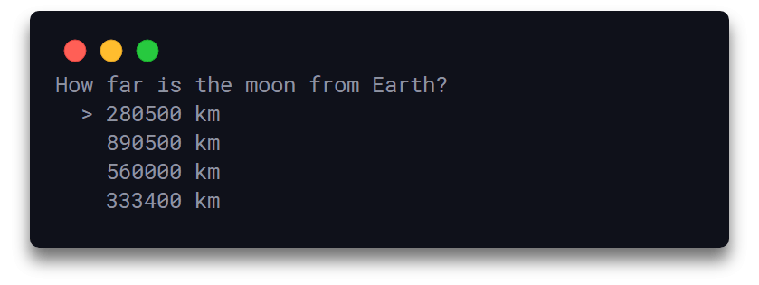
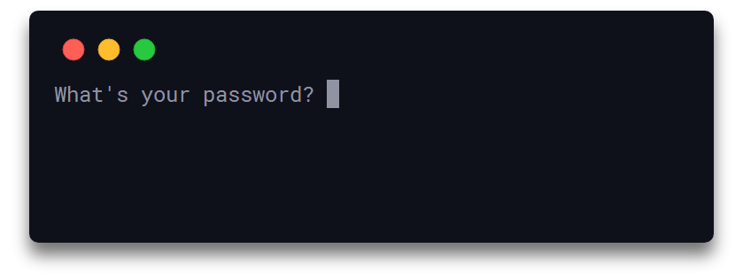

<h1 align="center">
  Qoa
</h1>

<h4 align="center">
  Nxitje minimale interaktive të linjës së komandës
</h4>

<div align="center">
  
</div>

<div align="center">
  <sup><b>Sponsorizuar nga:</b></sup>
  <br>
  <a href="https://betterstack.com">
    <div>
      
    </div>
    <sup>
      Zbulo, Zgjidh dhe Parandaloni Kohën e Pushimit.
    </sup>
  </a>
</div>

## Përshkrimi

E lehtë dhe pa asnjë varësi të jashtme, qoa ju mundëson të pranoni lloje të ndryshme input-i nga përdoruesi përmes një grupi porosish intuitive, interaktive dhe të hollësishme të linjës së komandës. Biblioteka përdor një sintaksë të thjeshtë dhe minimale të përdorimit dhe përmban 7 ndërfaqe të konfiguruara të konzolës, si tekst i thjeshtë, porosi konfirmimi dhe fjalëkalimi/sekreti si dhe porosi për shtypje të vetme të tastit, quiz dhe menu të shumta zgjedhjeje që mund të navigohen.

Ju mund të mbështetni procesin e zhvillimit përmes [GitHub Sponsors](https://github.com/sponsors/klaudiosinani).

Vizitoni [udhëzimet e kontributit](https://github.com/klaudiosinani/qoa/blob/master/contributing.md#translating-documentation) për të mësuar më shumë si të përktheni këtë dokument në më shumë gjuhë.

## Veçoritë Kryesore

- 7 porosi interaktive të gatshme
- Pa asnjë varësi
- E lehtë dhe e shpejtë [8.8kB / 71ms](https://bundlephobia.com/result?p=qoa)
- Output i pastër dhe i koncisë
- Sintaksë përdorimi e thjeshtë dhe minimale
- Menu navigimi, quiz dhe tastat e shpejtë
- Ndërfaqe të sigurta dhe të fshehta input-i
- Përdor shprehje async/await
- E konfigurueshme dhe e personalizueshme

## Përmbajtja

- [Përshkrimi](#përshkrimi)
- [Veçoritë Kryesore](#vecorite-kryesore)
- [Instalimi](#instalimi)
- [Përdorimi](#perdorimi)
- [Porositë](#porosite)
- [Konfigurimi](#konfigurimi)
- [API](#api)
- [Zhvillimi](#zhvillimi)
- [Të lidhura](#te-lidhura)
- [Ekipi](#ekipi)
- [Sponsorët](#sponsoret)
- [Licenca](#licenca)

## Instalimi

### Yarn

```bash
yarn add qoa
```

### NPM

```bash
npm install qoa
```

## Përdorimi

Importoni qoa dhe filloni të përdorni cilëndo nga porositë e gatshme:

- `confirm`
- `hidden`
- `input`
- `interactive`
- `keypress`
- `quiz`
- `secure`

Për të krijuar dhe shfaqur në mënyrë sekvenciale një seri porosish, përdorni funksionin asinkron `qoa.prompt`. Funksioni pranon si input një varg objektesh ku secili objekt përmban konfigurimin e porosisë përkatëse. Renditja e shfaqjes së porosive bazohet në rendin në të cilin objektet e konfigurimit janë përcaktuar brenda vargut. Funksioni kthën në fund një objekt të ri që përmban përgjigjet e përdoruesit për çdo porosi.

```js
const qoa = require('qoa');

const {log} = console;

const ps = [
  {
    type: 'input',
    query: 'Shkruani emrin tuaj të përdoruesit:',
    handle: 'username'
  },
  {
    type: 'secure',
    query: 'Shkruani fjalëkalimin tuaj:',
    handle: 'password'
  }
];

qoa.prompt(ps).then(log);
//=> { username: 'klaudiosinani', password: 'token' }
```

<div align="center">
  
</div>

Në alternativa, për raste jo sekvenciale, çdo porosi mund të inicializohet individualisht përmes funksionit asinkron përkatës, me objektin input që përmban veçoritë/konfigurimin e porosisë.

```js
const qoa = require('qoa');

const {log} = console;

const login = async () => {
  const username = await qoa.input({
    query: 'Shkruani emrin tuaj të përdoruesit:',
    handle: 'username'
  });

  const password = await qoa.secure({
    query: 'Shkruani fjalëkalimin tuaj:',
    handle: 'password'
  });

  return Object.assign({}, username, password);
}

login().then(log);
//=> { username: 'klaudiosinani', password: 'token' }
```

## Porositë

### Porosia Konfirmuese

Inicializon një porosi input tekstuale me dy opsione `prano` & `refuzo`. Bazuar në input-in e dhënë nga përdoruesi, kërkesa e shfaqur nga porosia konfirmohet ose refuzohet. Për të konfirmuar kërkesën, pra për të kthyer `true`, përdoruesi duhet të japë saktësisht string-un e caktuar `prano` (mundësisht përputhje e plotë). Për çdo input tjetër, kërkesa refuzohet dhe kthehet `false`. Vlera e kthimit është një objekt i ri me rezultatin e porosisë të ruajtur nën pronësinë e veçantë `handle`.

```js
const qoa = require('qoa');

const {log} = console;

const confirm = {
  type: 'confirm',
  query: 'Të përditësohet Qoa në versionin e fundit?',
  handle: 'update',
  accept: 'Y',
  deny: 'n'
};

// duke përdorur metodën asinkrone `prompt`
qoa.prompt([confirm]).then(log);
//=> { update: true }

// duke përdorur metodën asinkrone `confirm`
qoa.confirm(confirm).then(log);
//=> { update: true }
```

<div align="center">
  
</div>

### Porosia e Fshehtë

Inicializon një porosi tekstuale ku çdo karakter i shtypur nga përdoruesi fshihet automatikisht. Vlera e kthimit është një objekt i ri me rezultatin e porosisë të ruajtur nën pronësinë e veçantë `handle`.

```js
const qoa = require('qoa');

const {log} = console;

const hidden = {
  type: 'hidden',
  query: '[sudo] fjalëkalimi për admin:',
  handle: 'sudo'
};

qoa.prompt([hidden]).then(log);
//=> { sudo: 'admin' }

qoa.hidden(hidden).then(log);
//=> { sudo: 'admin' }
```

<div align="center">
  
</div>

### Porosia Input

Inicializon një porosi tekstuale ku input-i mund të jepet lirisht nga përdoruesi. Vlera e kthimit është një objekt i ri me rezultatin e porosisë të ruajtur nën pronësinë e veçantë `handle`.

```js
const qoa = require('qoa');

const {log} = console;

const input = {
  type: 'input',
  query: 'Zgjidhni emrin tuaj të përdoruesit:',
  handle: 'username'
};

qoa.prompt([input]).then(log);
//=> { username: 'klaudiosinani' }

qoa.input(input).then(log);
//=> { username: 'klaudiosinani' }
```

<div align="center">
  
</div>

### Porosia Interaktive

Inicializon një menu porosi interaktive që mund të navigohet, ku përdoruesi mund të navigojë midis një grupi opsionesh dhe të zgjedhë vetëm njërën prej tyre. Opsionet mund të përcaktohen në vargun `menu`, ndërsa simboli navigues mund të personalizohet përmes opsionit `symbol` dhe nëse lihet bosh do të përdoret string-u parazgjedhur `'>'`. Vlera e kthimit është një objekt i ri me opsionin e zgjedhur të ruajtur nën pronësinë e veçantë `handle`. Menunë interaktive mund të navigoni me shigjetat lart/poshtë ose me tastat `k` dhe `j`.

```js
const qoa = require('qoa');

const {log} = console;

const interactive = {
  type: 'interactive',
  query: 'Cila është ëmbëlsira juaj e preferuar?',
  handle: 'treat',
  symbol: '>',
  menu: [
    'Çokollatë',
    'Kapcake',
    'Akullore'
  ]
};

qoa.prompt([interactive]).then(log);
//=> { treat: 'Kapcake' }

qoa.interactive(interactive).then(log);
//=> { treat: 'Kapcake' }
```

<div align="center">
  
</div>

### Porosia Keypress

Inicializon një menu porosi të pa-navigueshme, ku përdoruesi mund të zgjedhë njërën nga opsionet e përcaktuara në vargun `menu` duke shtypur tastin unik që i korrespondon asaj. Opsionet mund të jenë deri në `9`, dhe tastet janë numra të plotë `x` ku `1 <= x <= 9`. Vlera e kthimit është një objekt i ri me opsionin e zgjedhur të ruajtur nën pronësinë e veçantë `handle`.

```js
const qoa = require('qoa');

const {log} = console;

const keypress = {
  type: 'keypress',
  query: 'Sa të dobishme janë veçoritë e reja?',
  handle: 'features',
  menu: [
    'Meh',
    'Mesatarisht',
    'Shumë',
    'Super'
  ]
};

qoa.prompt([keypress]).then(log);
//=> { features: 'Shumë' }

qoa.keypress(keypress).then(log);
//=> { features: 'Shumë' }
```

<div align="center">
  
</div>

### Porosia Quiz

Inicializon një menu quiz interaktive të navigueshme, ku përdoruesi mund të navigojë midis një grupi opsionesh dhe të zgjedhë vetëm njërën prej tyre. Menuja përbëhet nga një numër opsionesh `amount`, prej të cilave vlera e `answer` është automatikisht njëra prej tyre, që korrespondon me përgjigjen e saktë për kërkesën, dhe `amount - 1` janë zgjedhur rastësisht nga vargu `choices`. Simboli navigues mund të personalizohet përmes opsionit `symbol` dhe nëse lihet bosh përdoret string-u parazgjedhur `'>'`. Vlera e kthimit është një objekt i ri që përmban opsionin e zgjedhur të ruajtur nën pronësinë e veçantë `handle` dhe një atribut boolean `isCorrect`, që tregon nëse zgjedhja e bërë nga përdoruesi ka qenë ajo e saktë. Quiz-i mund të navigohet me shigjetat lart/poshtë ose me tastat `k` dhe `j`.

```js
const qoa = require('qoa');

const {log} = console;

const quiz = {
  type: 'quiz',
  query: 'Sa larg është hëna nga Toka?',
  handle: 'distance',
  answer: '333400 km',
  symbol: '>',
  amount: 4,
  choices: [
    '190000 km',
    '280500 km',
    '333400 km',
    '560000 km',
    '890500 km'
  ]
};

qoa.prompt([quiz]).then(log);
//=> { distance: { answer: '333400 km', isCorrect: true } }

qoa.quiz(quiz).then(log);
//=> { distance: { answer: '333400 km', isCorrect: true } }
```

<div align="center">
  
</div>

### Porosia Secure

Inicializon një porosi tekstuale ku çdo karakter i shtypur nga përdoruesi zëvendësohet automatikisht me simbolin `*`. Vlera e kthimit është një objekt me rezultatin e porosisë të ruajtur nën pronësinë e veçantë `handle`.

```js
const qoa = require('qoa');

const {log} = console;

const secure = {
  type: 'secure',
  query: 'Cili është fjalëkalimi juaj:',
  handle: 'password'
};

qoa.prompt([secure]).then(log);
//=> { password: 'password' }

qoa.secure(secure).then(log);
//=> { password: 'password' }
```

<div align="center">
  
</div>

## Konfigurimi

Qoa mund të konfigurohet në mënyrë kolektive përmes funksionit `qoa.config()`, i cili pranon një objekt me dy atribute: `prefix` dhe `underlineQuery`. Konfigurimi aplikohet për të gjitha porositë që i përkasin instancës së targetuar qoa.

##### `prefix`

- Tipi: `String`
- Parazgjedhur: `''`

String që të përfshihet si prefix në kërkesën e çdo porosie.

##### `underlineQuery`

- Tipi: `Boolean`
- Parazgjedhur: `false`

Nënvizon kërkesën e çdo porosie.

```js
const qoa = require('qoa');

qoa.config({
  prefix: '>', // Përdor string-un `>` si prefix në të gjitha kërkesat
  underlineQuery: false // Mos nënvizo kërkesat
})

qoa.secure({
  type: 'secure',
  query: 'Shkruani fjalëkalimin tuaj:',
  handle: 'password'
});
//=> > Shkruani fjalëkalimin tuaj: ******
```

Për personalizim të veçantë janë të disponueshme funksionet `prefix` dhe `underlineQuery`.

```js
const qoa = require('qoa');

qoa.prefix('>');

qoa.underlineQuery(false);

qoa.secure({
  type: 'secure',
  query: 'Shkruani fjalëkalimin tuaj:',
  handle: 'password'
});
//=> > Shkruani fjalëkalimin tuaj: ******
```

## API

#### qoa.`prompt([, configObj])`

- Tipi: `Function`
- Async: `True`
- Kthen: `Object`

Krijoni dhe shfaqni në mënyrë sekvenciale një seri porosish.

##### `configObj`

- Tipi: `Object`

Objekt që përmban konfigurimin e një porosie. Mund të përmbajë cilindo nga opsionet e dokumentuara më sipër.

#### qoa.`confirm({ type, query, handle, accept, deny })`

- Tipi: `Function`
- Async: `True`
- Kthen: `Object`

Krijo dhe shfaq një porosi `confirm`.

##### `type`

- Tipi: `String`
- Parazgjedhur: `'confirm'`

Tregon llojin e porosisë. 

##### `query`

- Tipi: `String`

Kërkesa që shfaqet nga porosia.

##### `handle`

- Tipi: `String`

Emri i atributit nën të cilin do të ruhen përgjigjet e porosisë në objektin e kthyer.

##### `accept`

- Tipi: `String`
- Parazgjedhur: `'Y'`

String që duhet të shtypet për të konfirmuar porosinë.

##### `deny`

- Tipi: `String`
- Parazgjedhur: `'n'`

String që duhet të shtypet për të refuzuar porosinë.

#### qoa.`hidden({ type, query, handle })`

- Tipi: `Function`
- Async: `True`
- Kthen: `Object`

Krijo dhe shfaq një porosi `hidden`.

##### `type`

- Tipi: `String`
- Parazgjedhur: `'hidden'`

Tregon llojin e porosisë.

##### `query`

- Tipi: `String`

Kërkesa që shfaqet nga porosia.

##### `handle`

- Tipi: `String`

Emri i atributit nën të cilin do të ruhen përgjigjet e porosisë në objektin e kthyer.

#### qoa.`input({ type, query, handle })`

- Tipi: `Function`
- Async: `True`
- Kthen: `Object`

Krijo dhe shfaq një porosi `input`.

##### `type`

- Tipi: `String`
- Parazgjedhur: `'input'`

Tregon llojin e porosisë.

##### `query`

- Tipi: `String`

Kërkesa që shfaqet nga porosia.

##### `handle`

- Tipi: `String`

Emri i atributit nën të cilin do të ruhen përgjigjet e porosisë në objektin e kthyer.

#### qoa.`interactive({ type, query, handle, symbol, menu })`

- Tipi: `Function`
- Async: `True`
- Kthen: `Object`

Krijo dhe shfaq një porosi `interactive`.

##### `type`

- Tipi: `String`
- Parazgjedhur: `'interactive'`

Tregon llojin e porosisë.

##### `query`

- Tipi: `String`

Kërkesa që shfaqet nga porosia.

##### `handle`

- Tipi: `String`

Emri i atributit nën të cilin do të ruhen përgjigjet e porosisë në objektin e kthyer.

##### `symbol`

- Tipi: `String`
- Parazgjedhur: `'>'`

String që përdoret si simbol navigues për menunë.

##### `menu`

- Tipi: `String[]`

Vargu që përmban opsionet e menuseve.

#### qoa.`keypress({ type, query, handle, menu })`

- Tipi: `Function`
- Async: `True`
- Kthen: `Object`

Krijo dhe shfaq një porosi `keypress`.

##### `type`

- Tipi: `String`
- Parazgjedhur: `'keypress'`

Tregon llojin e porosisë.

##### `query`

- Tipi: `String`

Kërkesa që shfaqet nga porosia.

##### `handle`

- Tipi: `String`

Emri i atributit nën të cilin do të ruhen përgjigjet e porosisë në objektin e kthyer.

##### `menu`

- Tipi: `String[]`

Vargu që përmban opsionet e menuseve.

#### qoa.`quiz({ type, query, handle, answer, symbol, amount, choices })`

- Tipi: `Function`
- Async: `True`
- Kthen: `Object`

Krijo dhe shfaq një porosi `quiz`.

##### `type`

- Tipi: `String`
- Parazgjedhur: `'quiz'`

Tregon llojin e porosisë.

##### `query`

- Tipi: `String`

Kërkesa që shfaqet nga porosia.

##### `handle`

- Tipi: `String`

Emri i atributit nën të cilin do të ruhen përgjigjet e porosisë në objektin e kthyer.

##### `answer`

- Tipi: `String`

Përgjigja e saktë për quiz-in.

##### `symbol`

- Tipi: `String`
- Parazgjedhur: `'>'`

String që përdoret si simbol navigues për menunë.

##### `amount`

- Tipi: `Number`
- Parazgjedhur: `3`

Numri i opsioneve të përfshirë në menunë.

##### `choices`

- Tipi: `String[]`

Vargu që përmban opsionet e kandidatit të menuseve.

#### qoa.`secure({ type, query, handle })`

- Tipi: `Function`
- Async: `True`
- Kthen: `Object`

Krijo dhe shfaq një porosi `secure`.

##### `type`

- Tipi: `String`
- Parazgjedhur: `'secure'`

Tregon llojin e porosisë.

##### `query`

- Tipi: `String`

Kërkesa që shfaqet nga porosia.

##### `handle`

- Tipi: `String`

Emri i atributit nën të cilin do të ruhen përgjigjet e porosisë në objektin e kthyer.

#### qoa.`config({ prefix, underlineQuery })`

- Tipi: `Function`
- Async: `False`

Konfiguro në mënyrë kolektive instancën e qoa.

##### `prefix`

- Tipi: `String`
- Parazgjedhur: `''`

String që përfshihet si prefix për çdo kërkesë të porosive.

##### `underlineQuery`

- Tipi: `Boolean`
- Parazgjedhur: `false`

Nënvizon kërkesën e çdo porosie.

#### qoa.`prefix(str)`

- Tipi: `Function`
- Async: `False`

Shton prefix-in str në çdo kërkesë të porosive të instancës targetuar qoa.

##### `str`

- Tipi: `String`

String që përfshihet si prefix për çdo kërkesë të porosive.

#### qoa.`underlineQuery(status)`

- Tipi: `Function`
- Async: `False`

Nënvizon kërkesën e çdo porosie te instancës targetuar qoa.

##### `status`

- Tipi: `Boolean`

Nënvizon kërkesën e çdo porosie.

#### qoa.`clearScreen()`

- Tipi: `Function`
- Async: `False`

Lëviz kursorin në këndin lart-majtë të konzolës dhe pastron gjithçka poshtë saj.

## Zhvillimi

Për më shumë informacion rreth kontributit në projekt, lexoni [udhëzimet e kontributit](https://github.com/klaudiosinani/qoa/blob/master/contributing.md).

- Bëni fork të repository dhe klononi në makinën tuaj
- Navigoni te fork-u juaj lokal: `cd qoa`
- Instaloni varësitë e projektit: `npm install` ose `yarn install`
- Kontrolloni kodin për gabime: `npm test` ose `yarn test`

## Të lidhura

- [signale](https://github.com/klaudiosinani/signale) - Mjet regjistrimi shumë i konfigurueshëm
- [taskbook](https://github.com/klaudiosinani/taskbook) - Detyra, panele dhe shënime për mjedisin e linjës së komandës
- [hyperocean](https://github.com/klaudiosinani/hyperocean) - Temë e thellë blu oqeanike për terminalin Hyper

## Ekipi

- Klaudio Sinani [(@klaudiosinani)](https://github.com/klaudiosinani)

## Sponsorët

Falënderim i madh për të gjithë njerëzit dhe kompanitë që mbështesin punën tonë Open Source:

- [Better Stack: Zbulo, Zgjidh dhe Parandaloni Kohën e Pushimit.](https://betterstack.com/)

## Licenca

[MIT](https://github.com/klaudiosinani/qoa/blob/master/license.md)
