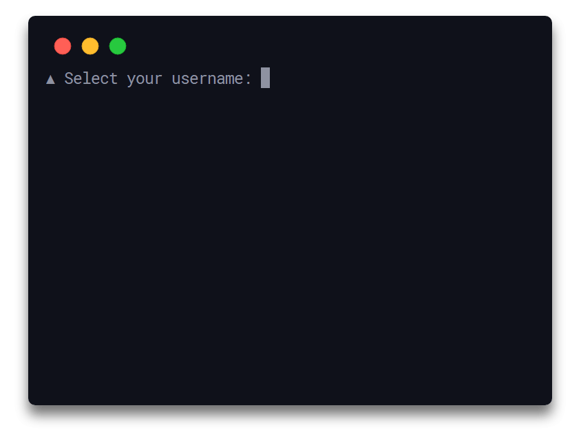

<h1 align="center">
  Qoa
</h1>

<h4 align="center">
  💬 Minimal interactive command-line prompts
</h4>

<div align="center">
  
</div>

<p align="center">
  <a href="https://travis-ci.org/klaussinani/qoa">
    
  </a>
</p>

## Description

Lightweight and without any external dependencies qoa enables you to receive various types of user input through a set of intuitive, interactive & verbose command-line prompts. The library utilizes a simple & minimal usage syntax and contains 7 configurable console interfaces, such as plain text, confirmation & password/secret prompts as well as single keypress, quiz & multiple-choice navigable menus.

Visit the [contributing guidelines](https://github.com/klaussinani/qoa/blob/master/contributing.md#translating-documentation) to learn more on how to translate this document into more languages.

Come over to [Gitter](https://gitter.im/klaussinani/qoa) or [Twitter](https://twitter.com/klaussinani) to share your thoughts on the project.

## Highlights

- 7 out-of-the-box interactive prompts
- Zero dependencies
- Lightweight & fast
- Clean & concise output
- Simple & minimal usage syntax
- Navigation, quiz & keypress menus
- Secure & hidden input interfaces
- Utilizes async/await expressions
- Configurable & customizable

## Contents

- [Description](#description)
- [Highlights](#highlights)
- [Install](#install)
- [Usage](#usage)
- [Prompts](#prompts)
- [Configuration](#configuration)
- [API](#api)
- [Development](#development)
- [Related](#related)
- [Team](#team)
- [License](#license)

## Install

```bash
npm install qoa
```

## Usage

## Prompts

### Confirm Prompt

### Hidden Prompt

### Input Prompt

### Interactive Prompt

### Keypress Prompt

### Quiz Prompt

### Secure Prompt

## Configuration

## API

## Development

For more info on how to contribute to the project, please read the [contributing guidelines](https://github.com/klaussinani/qoa/blob/master/contributing.md).

- Fork the repository and clone it to your machine
- Navigate to your local fork: `cd qoa`
- Install the project dependencies: `npm install` or `yarn install`
- Lint code for errors: `npm test` or `yarn test`

## Related

- [signale](https://github.com/klaussinani/signale) - Hackable console logger
- [taskbook](https://github.com/klaussinani/taskbook) - Tasks, boards & notes for the command-line habitat

## Team

- Klaus Sinani [(@klaussinani)](https://github.com/klaussinani)

## License

[MIT](https://github.com/klaussinani/qoa/blob/master/license.md)
